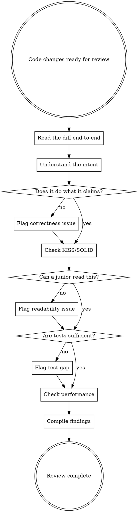

# Code Review

## Overview

Review code for correctness, readability, and maintainability. Every line must be understandable by a junior engineer reading it for the first time.

**Core principle:** Simple, readable code that works > clever code that impresses. A confused reader is a bug waiting to happen.

## When to Use

- Reviewing a PR or diff before merge
- After implementing a feature or bugfix
- Before committing significant changes
- When refactoring existing code
- When a subagent completes an implementation task

**Not for:** Trivial one-line fixes, config-only changes, or pure formatting commits.

## Review Process



## Review Checklist

### 1. Correctness

The code must do what it claims to do.

| Check | Ask Yourself |
|-------|-------------|
| Logic | Does the control flow handle all cases? |
| Edge cases | What happens with empty input, None, zero, negative, max values? |
| Error handling | Do exceptions propagate correctly? Are errors logged, not swallowed? |
| Off-by-one | Are loop bounds, slicing, and indexing correct? |
| Concurrency | Any shared state accessed without locks? Race conditions? |
| Data types | Are types consistent? String vs int, float vs Decimal? |

### 2. KISS - Keep It Simple

Every piece of code should be as simple as possible, but no simpler.

**Flag when you see:**
- A function doing more than one thing (violates Single Responsibility)
- Nested conditionals deeper than 2 levels - flatten with early returns or guard clauses
- "Clever" one-liners that require mental compilation to understand
- Abstractions wrapping a single use case - inline it until you have 2+ callers
- Config/parameters for behavior that will never vary
- Inheritance hierarchies when composition or a plain function would suffice

**The 3-copy rule:** Three similar blocks of code is acceptable. Don't abstract until there are 3+ duplicates AND the abstraction genuinely simplifies.

<Good>
```python
def calculate_sharpe(returns: pd.Series, risk_free_rate: float = 0.0) -> float:
    excess = returns - risk_free_rate
    if excess.std() == 0:
        return 0.0
    return float(excess.mean() / excess.std() * (252 ** 0.5))
```
Clear, one thing, obvious intent.
</Good>

<Bad>
```python
def calculate_risk_adjusted_metric(
    returns: pd.Series,
    metric: str = "sharpe",
    risk_free_rate: float = 0.0,
    annualization_factor: int = 252,
    method: str = "standard",
) -> float:
    # 50 lines handling 4 metrics, 3 methods, 6 edge cases
    # Only ever called with metric="sharpe", method="standard"
    ...
```
Over-engineered for a single use case.
</Bad>

### 3. SOLID (Applied Pragmatically)

Apply SOLID where it reduces complexity, not where it adds layers for the sake of structure.

| Principle | Practical Application | Red Flag |
|-----------|----------------------|----------|
| **S**ingle Responsibility | One function = one job. If you need "and" to describe it, split it. | Function named `download_and_process_and_save` |
| **O**pen/Closed | Extend via new classes/functions, don't modify working code | Adding `if type == "new_thing"` to a growing switch |
| **L**iskov Substitution | Subclasses must honor parent contracts | Override that changes return type or skips validation |
| **I**nterface Segregation | Don't force callers to depend on methods they don't use | ABC with 10 abstract methods when most subclasses stub half |
| **D**ependency Inversion | Depend on abstractions at module boundaries, not everywhere | Creating interfaces for internal helpers with one implementation |

**Pragmatic SOLID:** Don't create an interface for a class that will only ever have one implementation. Don't split a 20-line function into 4 five-line functions that are harder to follow. Structure should serve understanding, not the other way around.

### 4. Readability (The Junior Engineer Test)

Imagine a junior engineer opens this file at 9 AM on their first week. Can they understand what it does and why?

| Check | Standard |
|-------|----------|
| **Naming** | Variables and functions describe their purpose. `df` -> `daily_returns`. `x` -> `price_threshold`. |
| **Function length** | If you must scroll to read a function, it probably does too much. Target: fits on one screen (~30-40 lines). |
| **Comments** | Explain WHY, never WHAT. No `# increment counter` on `i += 1`. Yes to `# Skip first bar - incomplete data from market open`. |
| **Flow** | Linear top-to-bottom reading. Early returns for error cases. No ping-ponging between functions to understand one operation. |
| **Magic values** | Named constants for non-obvious numbers. `252` -> `TRADING_DAYS_PER_YEAR`. Exception: 0, 1, -1, 100 in obvious context. |
| **Nesting** | Max 2 levels of indentation in business logic. Use guard clauses, early returns, or extract helpers. |

<Good>
```python
def get_active_positions(portfolio: Portfolio) -> list[Position]:
    if not portfolio.positions:
        return []

    cutoff = datetime.now() - timedelta(days=STALE_POSITION_DAYS)
    return [
        pos for pos in portfolio.positions
        if pos.quantity != 0 and pos.last_updated > cutoff
    ]
```
</Good>

<Bad>
```python
def process(p):
    r = []
    if p.positions:
        for pos in p.positions:
            if pos.quantity != 0:
                if pos.last_updated > datetime.now() - timedelta(days=30):
                    r.append(pos)
    return r
```
Cryptic names, deep nesting, magic number.
</Bad>

### 5. Unit Tests

Tests should prove the code works for its business purpose and edge cases, without being so verbose that they become a maintenance burden.

**What to test:**
- Business logic and core computations (the "happy path")
- Edge cases that could cause real failures (empty data, boundary values, None)
- Error paths that users or callers could actually trigger
- Integration points where data formats or contracts matter

**What NOT to test:**
- Trivial getters/setters or simple pass-through wrappers
- Internal implementation details that change with refactors
- Every permutation of inputs when a few representative cases suffice
- Framework behavior (don't test that pandas groupby works)

**Test quality standards:**

| Quality | Good | Bad |
|---------|------|-----|
| **Focused** | One behavior per test | `test_download_parse_validate_save` |
| **Named clearly** | `test_empty_returns_yields_zero_sharpe` | `test_edge_case_3` |
| **Minimal mocking** | Mock only external I/O (APIs, disk, network) | Mock internal functions to force paths |
| **Readable setup** | 3-5 lines of setup, clear act, clear assert | 30-line setup that obscures intent |
| **Independent** | Each test runs in isolation | Tests depend on execution order |

**The sufficiency test:** If someone breaks the business logic, will at least one test fail? If yes, coverage is sufficient. If adding more tests only catches the same bugs differently, stop.

<Good>
```python
class TestSharpeCalculation:
    def test_positive_returns(self):
        returns = pd.Series([0.01, 0.02, -0.005, 0.015])
        result = calculate_sharpe(returns)
        assert result > 0

    def test_zero_volatility_returns_zero(self):
        returns = pd.Series([0.01, 0.01, 0.01])
        assert calculate_sharpe(returns) == 0.0

    def test_empty_series_returns_zero(self):
        assert calculate_sharpe(pd.Series(dtype=float)) == 0.0
```
Three tests cover: normal case, edge case, empty input. Done.
</Good>

<Bad>
```python
class TestSharpeCalculation:
    def test_one_positive_return(self): ...
    def test_two_positive_returns(self): ...
    def test_three_positive_returns(self): ...
    def test_mixed_returns_1(self): ...
    def test_mixed_returns_2(self): ...
    def test_all_negative(self): ...
    def test_all_zero(self): ...
    def test_risk_free_rate_zero(self): ...
    def test_risk_free_rate_nonzero(self): ...
    def test_risk_free_rate_negative(self): ...
    # 15 more tests that all exercise the same 5-line function
```
Excessive - most of these catch the same bugs.
</Bad>

### 6. Performance

Don't optimize prematurely, but don't write obviously slow code either.

| Check | Flag When |
|-------|-----------|
| **Unnecessary copies** | `df.copy()` in a loop, or copying data that's only read |
| **N+1 patterns** | API call or DB query per item inside a loop |
| **Loading excess data** | Reading entire file/table when only a subset is needed |
| **Quadratic loops** | Nested loops over same collection when a set/dict lookup works |
| **String concatenation** | Building strings with `+=` in a loop instead of `join` or f-strings |
| **Blocking I/O** | Synchronous calls that could be parallelized or async |

**Rule of thumb:** If it processes <1000 items, readability wins over micro-optimization. If it processes >100K items, performance matters.

## Issue Severity

| Severity | Definition | Examples |
|----------|-----------|----------|
| **Critical** | Bugs, data corruption, security holes. Must fix. | Wrong calculation, SQL injection, silent data loss |
| **Important** | Will cause real problems if shipped. Should fix. | Missing error handling on external calls, test gaps for core logic, race condition |
| **Minor** | Improvements that help but aren't blocking. | Better variable name, slight restructure for clarity, optional test case |

**Calibration:** Most reviews should have 0 Critical issues. If you find >3 Important issues, the code likely needs rework, not incremental fixes.

## Output Format

```
### Summary
[1-2 sentences: what was changed and overall assessment]

### Strengths
[What's done well - be specific with file:line references]

### Issues

#### Critical (Must Fix)
[Bugs, correctness errors, security issues]

#### Important (Should Fix)
[Missing error handling, test gaps, readability problems]

#### Minor (Consider)
[Naming, style, optional improvements]

**For each issue:**
- File:line reference
- What's wrong
- Why it matters
- Suggested fix (if non-obvious)

### Assessment
**Ready to merge?** [Yes / With fixes / Needs rework]
```

## Common Mistakes Reviewers Make

| Mistake | Fix |
|---------|-----|
| Marking style nits as Important | Nits are Minor. Reserve Important for real problems. |
| Suggesting abstractions for single-use code | Only abstract when there are 3+ callers or the code is genuinely hard to follow. |
| Requesting tests for trivial code | A 3-line wrapper doesn't need its own test suite. |
| Ignoring the "why" | Don't just flag "this is wrong" - explain what breaks. |
| Rubber-stamping | "LGTM" without reading is worse than no review. |
| Bikeshedding | Don't block a PR over naming preferences when logic is correct. |

## Review Principles Summary

1. **Correct first** - Does it actually work?
2. **Simple second** - Is it the simplest approach that works?
3. **Readable third** - Can a junior understand it cold?
4. **Tested fourth** - Are business cases and edge cases covered (not exhaustively, sufficiently)?
5. **Performant fifth** - No obvious inefficiencies for the expected data scale?

If a piece of code passes all five, approve it. Don't hold code hostage for perfection.
