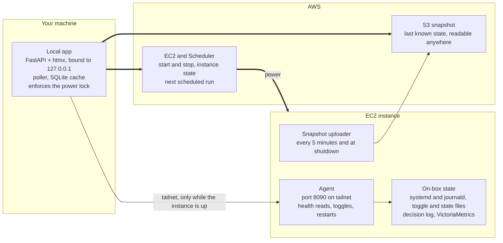

# Homeguard Console - Design

Date: 2026-10-05
Status: Approved for Phase 0 and Phase 1 (2026-10-05); Phases 2 and 3 approved in outline only
Author: Shuyang
Prototype: https://claude.ai/artifact/1k5dx3zeJw2kcPZyXbrbHq
Living copy: https://claude.ai/artifact/E4fFjNMe8iBrDAvyoy2ufT

## Executive Summary

Homeguard runs as a set of systemd services on a single EC2 instance (t4g.medium, us-east-1) that EventBridge Scheduler starts at 08:00 ET and stops at 20:00 ET on weekdays, and today the only ways to see its health or act on it are Grafana over the tailnet, a read-only Discord bot that runs on the same instance, and the shell scripts under infra/ec2/, all of which stop being useful once the instance is off. This document proposes Homeguard Console, a local operations console that runs on the operator's own machine as a FastAPI and htmx app, reads health and applies soft controls through a small agent on the instance over Tailscale, and calls AWS directly for instance power and for the last known state so that it keeps working while the instance is stopped. Power changes from the console would be limited to the hours when NYSE is closed, with a 15 minute buffer on each side of the session, and the one exception would be a recovery start when the schedule expects the instance to be running and it is not. The console would not replace Grafana for long-range metric exploration or the Discord bot for chat-based questions, and it deliberately leaves position-affecting actions such as closing positions or cancelling orders out of the first version.

This draft was written against main at 8cff69a (2026-07-28) and re-verified on 2026-10-05 against main at c63e5dd and the production deploy branch `ramp-phase4-turnover-regime-research` at f009df5 (see Revision notes). The UI it describes is in the [Homeguard Console prototype](https://claude.ai/artifact/1k5dx3zeJw2kcPZyXbrbHq).

| Decision | Choice |
| --- | --- |
| Where it runs | On the operator's machine, bound to 127.0.0.1 |
| Local stack | FastAPI with Jinja templates and htmx, with the charts and schedule rail as server-rendered SVG |
| Reaching the instance | A small agent on the instance, published to the tailnet with `tailscale serve` |
| State while the instance is off | An S3 snapshot every 5 minutes and at shutdown, plus a local SQLite cache |
| Power policy | Start and Stop locked from 09:15 to 16:15 ET on NYSE trading days, taken from the exchange calendar |
| Exception to the lock | Recovery start when the schedule expects the instance to be running |
| In-session emergency control | Turn off all trading |
| Left out of the first version | Closing positions and cancelling orders |
| Getting code onto the instance | Built on main, cherry-picked onto the deploy branch `ramp-phase4-turnover-regime-research` |
| First build cycle | Phase 0 (toggle fix only) and Phase 1 (read-only agent with `/status` and `/decisions`) |

## Revision notes (2026-10-05)

A re-check of every repo claim in this document found that none of the paths it depends on changed between 8cff69a and c63e5dd, so the design stands, with the corrections and scope changes below. The sections that follow have been edited to match.

- **The instance does not run main.** EC2 deploys `ramp-phase4-turnover-regime-research`, which split from main at bb1b84f (2026-05-21) and has since diverged by 574 commits. Anything the instance runs, including the Phase 0 fix and the agent, has to be cherry-picked onto that branch, the same way production hotfixes are today. The file formats the Phase 1 agent reads (the decision record JSON from `src/trading/decision_log/record.py`, the snapshot JSON from `src/monitoring/snapshot.py`) are produced by code that is byte-identical on both branches, and the toggle defaults in `_load_toggle()` are identical too, so both cherry-picks are expected to apply cleanly.
- **The agent cannot import anything under `src.trading`.** `src/trading/__init__.py` imports `BrokerFactory`, so importing even `src.trading.decision_log.reader` loads 1,298 modules including pandas and alpaca and adds about 75MB of resident memory, which would breach the agent's `MemoryMax=96M`. The agent therefore reads `_latest/<strategy>.json` as plain JSON (the record module documents its JSON shape as stable) and imports only yaml, python-dotenv, `src.utils.logger`, `src.utils.timezone` and `src.settings`, which together add about 10MB. A test pins this.
- **The deploy branch writes an extra file into `_latest/`.** It adds `_latest/<strategy>_position_state.json` next to `_latest/<strategy>.json`, so the agent must never glob `_latest/` to discover strategies; it takes the strategy list from the toggle file and the units instead.
- **RAMP's 15:55 is not in any config file.** It is hardcoded in `src/trading/adapters/ramp_live_adapter.py`, and the OMR adapter hardcodes its times as well (its config files carry the same values but the adapter does not read them). The Local app section's claim that the app can read decision times from `config/trading/` is therefore wrong for RAMP; Phase 2 has to decide between a small decision-times table in the local app and having the agent report it.
- **`src/monitoring/server.py` uses plain `HTTPServer`,** not `ThreadingHTTPServer`, and its `/health` body also carries `strategy` and `uptime_seconds`, though it still reports ok whenever its thread is alive. The agent uses `ThreadingHTTPServer` regardless.
- **The IAM user and the S3 bucket move from Phase 0 to Phase 2,** next to their first consumers (the local app's boto3 calls and the snapshot uploader), which is also when the question of which instance role is attached has to be answered.
- **`GET /series` and `GET /logs` move from Phase 1 to Phase 2,** since their only consumers are Phase 2 panels and their named-query allowlist is best defined next to the panel that renders it.
- **Unit files live in `infra/ec2/services/`** (homeguard-multi.service sits at `infra/ec2/`), on both branches.
- **Dependencies.** fastapi, uvicorn, jinja2, boto3, httpx and pytest are installed in the fintech environment, but fastapi, uvicorn, jinja2 and boto3 are not in requirements.txt, and moto is not installed. botocore's `Stubber` ships with boto3 and covers the AWS tests in Phase 2 without moto.

## Context

Today we have three ways to look at or act on the running system, and only the AWS CLI scripts among them keep working once the instance is stopped. Grafana, VictoriaMetrics, Loki and Promtail all run on the instance and bind to 127.0.0.1, with Grafana published to the tailnet through `tailscale serve --bg 3000` (infra/ec2/setup/install_tailscale.sh), which works well for dashboards but stops answering as soon as the 20:00 ET schedule stops the instance. The Discord bot in src/discord_bot/ is read-only by design, with an allowlist in security.py that blocks `systemctl start`, `stop` and `restart`, and since it also runs on the instance, it can neither report on nor start anything while the instance is off. The remaining tools are the scripts under infra/ec2/ (local_start_instance.sh, toggle_strategy.sh, strategy_status.sh, check_bot.bat), each of which needs either the AWS CLI or an SSH session and a terminal, and none of which gives a view of overall state.

Beyond reachability, several of these tools have drifted from the services that actually run. The stocks side runs as a single unit, homeguard-multi, pinned to RAMP with `--strategy ramp`, while the per-strategy homeguard-omr and homeguard-ramp unit files still exist but are disabled, and CSCM runs as homeguard-cscm. toggle_strategy.sh and strategy_status.sh only accept omr and mp, and the Discord bot's `TRADING_SERVICES` list is `["homeguard-omr", "homeguard-mp"]`, so these tools check units that are not running and would report the stocks side as down while RAMP is trading normally. config/trading/strategy_toggle.yaml currently has RAMP and MP enabled with OMR and CSCM disabled, though no documented unit runs MP, so its switch being on has no effect today. docs/HEALTH_CHECK_CHEATSHEET.md still describes a `homeguard-trading` service that the per-strategy unit files declare `Conflicts=` with, along with an instance window of roughly 09:00 to 16:30, while the schedule in infra/terraform/scheduled_start_stop.tf runs from 08:00 to 20:00 ET on weekdays plus a Saturday 23:00 UTC to Sunday 00:10 UTC window for CSCM.

The per-strategy metrics endpoints also do less than their names suggest. Each trading process serves `/metrics` and `/health` on 127.0.0.1 at the port its unit sets (8082 for RAMP under homeguard-multi and 8084 for CSCM today), but `/health` in src/monitoring/server.py returns `"status": "ok"` (alongside `strategy` and `uptime_seconds`) whenever its HTTP thread is alive, which means a trading loop that has stalled would still report as healthy. The more meaningful liveness signals already exist as metrics (`hg_strategy_last_signal_timestamp`, `hg_broker_last_heartbeat_timestamp`) and as decision records under data/trading/decisions/, so the console should be built on those instead of on `/health`.

## Goals and non-goals

The console exists to let a single operator tell, from a machine other than the instance, whether Homeguard is up and trading as intended, and to act on it within a small set of controls whose effects we already understand well. With that in mind, we would hold it to the following goals.

- Show the instance's power state against its schedule using the AWS APIs, so that this view still works while the instance is stopped.
- Show per-strategy health from the signals that reflect trading (decision recency and outcome, broker heartbeat, process state) instead of HTTP liveness.
- Keep the last known state of the instance readable from any machine after it stops, with every value labelled by its source and its age.
- Allow starting and stopping the instance outside market hours, turning trading on or off per strategy and for all strategies at once, and restarting individual services.
- Enforce every safety rule on the server, so that the browser cannot bypass any of them.

Equally, there are several things the console should not attempt, as each of them either already has a home or carries a risk that the first version does not need to take on.

- Replacing Grafana for long-range metric exploration, alert rules or Loki log search, which the console would link out to instead.
- Closing positions, cancelling orders or flattening a strategy, since a bug in those paths turns directly into broker orders.
- Access from a phone or from outside the tailnet, as the app binds to 127.0.0.1 on the operator's machine.
- Changing strategy parameters, variants or universes, given that the console only changes the existing `enabled` flag.
- Replacing or extending the Discord bot.
- Multiple users or roles, or any audit trail beyond a local action log and the instance journal.

## Architecture

The design splits along the one boundary that matters most for availability, which is whether a piece of state can only be read on the instance or can also be read while the instance is stopped. Instance power, the schedule and the results of the start and stop Lambdas live in AWS, so the local app reads and changes them directly with a scoped IAM profile, and it reads the last uploaded snapshot from S3 whenever the agent cannot be reached. Everything else (systemd state, the journal, the toggle and state files, the decision log and VictoriaMetrics) only exists on the instance, so a small agent there reads it on the console's behalf and is reachable only over the tailnet through `tailscale serve`, the same mechanism that already publishes Grafana.

The thick paths keep working while the instance is stopped, and only the tailnet path to the agent needs the instance to be up.

In practice this means the console degrades in steps rather than all at once. While the instance is up, the local app polls the agent and shows live state, and once it stops, the app falls back to the snapshot the instance uploaded during shutdown and labels each value with its age. The power controls keep working in both cases, since they never depend on the instance.

## Data sources and freshness

When the instance is stopped, the console can no longer read anything from it, though the values it shows do not all go stale in the same way, and we should treat them accordingly. Process state, the last decision and its gates, the trading switches and the positions Homeguard believes it holds are owned by the instance, and since nothing can change them while it is off, their value as of the stop is still their current value. Prices, position values, day P&L and account equity are owned by the market and the broker, and they keep moving overnight, which matters here since RAMP holds positions across days and OMR is designed to hold from its 15:50 entry to its 09:31 exit, a span that covers the entire stopped window. Instance state, the next scheduled start and stop, and the results of the start and stop Lambdas are owned by AWS, so they stay live from the operator's machine regardless.

| Class | Examples | While the instance is stopped | How the console shows it |
| --- | --- | --- | --- |
| Frozen at stop | systemd state, last decision and gates, trading switches, Homeguard's positions | Correct as of the stop | Normal rendering, stamped with the stop time |
| Drifting | Position value, day P&L, account equity | Wrong once prices move | Greyed out with its age, never rendered as current |
| Unknown | IB Gateway login, broker heartbeat, data stream, host memory | Cannot be measured | Hatched tile reading "Unknown since 20:00", with the last reading underneath |
| Always live | Instance state, schedule, Lambda results | Live | Normal rendering |

The unknown class needs its own treatment because the console follows a dark cockpit convention, where normal readings stay grey and only exceptions take color, and an unknown health reading drawn in that same grey would read as normal at exactly the time when nothing is being measured.

Additionally, the console compares the actual instance state against what the schedule says it should be, which is what lets it tell a routine overnight stop apart from a failed morning start.

| Actual | Expected by schedule | Console shows |
| --- | --- | --- |
| Stopped | Stopped | Neutral, with the next scheduled start |
| Stopped | Running | Warning that the instance should be running, a link to the start Lambda's log, and recovery start enabled |
| Running | Stopped | Caution that the instance is running outside its schedule, from a manual start or a failed stop |
| Running, agent unreachable for over 2 minutes | Running | Warning that the instance is up but the console cannot reach it, which points at Tailscale or the agent and is never shown as stopped |

The start and stop Lambdas in infra/terraform/lambda/ catch their own exceptions and return a 500 in the response body instead of raising, so EventBridge Scheduler would record a failed start as a successful invocation, and this comparison is the first place a missed start would surface before someone notices that no decisions were made. The schedule also has no market holiday awareness and starts the instance at 08:00 on holidays as well, so the expected state should follow the schedule itself and not the exchange calendar, as otherwise every market holiday would raise a false caution.

## Controls and safety policy

Stopping the instance stops every strategy process and the IB Gateway at once, which leaves any order already submitted working at IBKR with nothing watching it and leaves a rebalance that was in progress partially applied, and since nothing restarts the instance until the next scheduled start at 08:00, a stop in the middle of the session would also cost the rest of that day's decisions. Starting it has a similar reach, as the enabled trading units start at boot (homeguard-multi through multi-user.target and homeguard-cscm through homeguard-trading.target), and the IB Gateway logs in through IBC, which ends any other session using the same IBKR username. With this in mind, power changes from the console would follow these rules.

1. Power changes are allowed only while NYSE is closed, with a 15 minute buffer on each side of the session, which on a regular trading day locks Start and Stop from 09:15 to 16:15 ET.
2. Session times come from pandas_market_calendars, which is already a dependency and is wrapped in src/backtesting/utils/market_calendar.py, so holidays leave power unlocked all day and early closes end the lock at 13:15 instead of 16:15.
3. Start is allowed during the lock only when the schedule expects the instance to be running and it is stopped, which is the recovery path for a failed 08:00 start or an instance that went down mid-session.
4. Stop has no override during the lock, and Start has no override beyond rule 3.
5. Outside the lock, Stop first checks whether any strategy holds the execution lock, and if one does, the console waits up to 3 minutes for it to be released before stopping, reporting what is still running if that wait times out.

We chose the 15 minute buffer to cover RAMP's data preload around the 09:30 open and OMR's 09:31 exit in the morning, and the fills from the 15:55 rebalance along with the post-trade logging in the afternoon, which is the path where exits have gone unlogged before. It is a single setting, so we can widen or narrow it once we see how the console is used. These rules only bind the console, and the AWS console and infra/ec2/local_stop_instance.sh remain available as escape hatches, which we would like to keep since the lock is there to prevent a casual click during the session, while a deliberate action from the operator should still have a path.

Beyond power, the console exposes the soft controls that already exist on the instance and adds no new trading behavior of its own.

| Control | Allowed | Effect | Mechanism |
| --- | --- | --- | --- |
| Turn trading on or off for one strategy | Whenever the agent is reachable | Applies at the strategy's next decision, with no restart | `StrategyStateManager.set_enabled`, which writes strategy_toggle.yaml atomically |
| Turn off all trading | Whenever the agent is reachable | Every strategy skips decisions from its next check, while positions stay open and working orders are not cancelled | The same call for every enabled strategy |
| Restart one service | Whenever the agent is reachable, with a warning within 15 minutes of an enabled strategy's scheduled decision | systemd stops and starts the unit, and decisions pause while it reloads data and reconnects | `sudo systemctl restart` through a sudoers entry per unit |
| Start or stop the instance | Per the rules above | The whole instance | EC2 `StartInstances` or `StopInstances` from the local app |

Since the lock removes Stop as an emergency control during the session, Turn off all trading becomes the in-session emergency path, and it is the better tool for that job in any case, as it takes effect at each strategy's next decision without losing any state. Closing positions and cancelling orders (scripts/trading/close_strategy_positions.py and scripts/trading/cancel_all_orders.py) stay out of the first version, as a bug in either path turns directly into broker orders, and once the read and soft control paths have been in use for a while, we would add Cancel open orders first.

## On-instance agent

Most of what the console needs from the instance only exists on its loopback interface or its local disk, including the metrics endpoints on 8082 and 8084, VictoriaMetrics on 8428, the toggle and state files, the decision log and the journal, so we would add a small agent that reads them on the console's behalf. The agent would live in src/console_agent/ and run from the existing checkout at /home/ec2-user/Homeguard, and we would build it on the standard library's `ThreadingHTTPServer` in the same way src/monitoring/server.py serves metrics, as it only needs a handful of routes and a framework would not save us much. It binds to 127.0.0.1:8090 and is published to the tailnet with `tailscale serve` on port 8443 next to the existing Grafana mapping (the exact flags should be checked against the installed Tailscale version), and every request must carry a `Tailscale-User-Login` header matching the operator's login, which `tailscale serve` sets on requests from tailnet users. A process on the instance could forge that header, though anything running there can already edit the toggle file or call systemctl, so the check exists to keep other tailnet devices out, and a local process forging it gains nothing it did not already have.

| Route | Phase | Source | Notes |
| --- | --- | --- | --- |
| GET /status | 1 | `systemctl show -p ActiveState,SubState,NRestarts,ActiveEnterTimestamp,MemoryCurrent,ExecStart` per unit, strategy_toggle.yaml, each strategy's snapshot JSON, the execution lock | One call that drives the overview, including which unit runs which strategy |
| GET /decisions | 1 | data/trading/decisions/_latest/, read as JSON without importing src.trading | Gate results for an expanded strategy row |
| GET /series | 2 | VictoriaMetrics `/api/v1/query_range` on 127.0.0.1:8428 | An allowlist of named queries, since exposing VictoriaMetrics itself would also expose its delete and import endpoints |
| GET /logs | 2 | `journalctl -o json` | Allowlisted units and a capped line count |
| POST /strategies/{name}/enabled | 3 | `StrategyStateManager.set_enabled(..., modified_by='console')` | Atomic write through the existing `os.replace` path |
| POST /services/{unit}/restart | 3 | `sudo systemctl restart` | Only the units that run a strategy (homeguard-multi and homeguard-cscm today) and homeguard-gateway |

Since the units are not named after the strategies they run, the agent should derive the mapping from the units themselves by reading the `ExecStart` of each enabled homeguard unit, taking the `--strategy` argument passed to run_live_paper_trading.py (ramp for homeguard-multi today) and treating run_cscm_live.py as cscm. The infrastructure units (homeguard-gateway, victoria-metrics, loki, promtail, grafana-server and node-exporter) can stay a short fixed list, since they do not change with the strategies. With this, the console follows a re-pinned unit without a code change, and it can show the one case that none of the existing tools can, which is a strategy whose switch is on with no unit running it, as MP is today. The execution lock is a single shared field in data/trading/strategy_positions.json with a holder, an acquired time and an expiry, and since `get_execution_lock_holder()` does not check the expiry, the agent should read the field directly and treat an expired lock as free, which matches how `acquire_execution_lock()` already behaves. Additionally, `StrategyStateManager.__init__` writes a backup of the state file and can create a default toggle file when one is missing, so the read path never constructs it at all and reads the toggle and state files directly as YAML and JSON, which keeps Phase 1 unable to write anything; the Phase 3 POST routes construct it once at startup instead of once per request.

The agent runs as ec2-user, and service restarts go through a sudoers drop-in that names each command in full, with one line per allowed unit and no wildcards (for example `ec2-user ALL=(root) NOPASSWD: /usr/bin/systemctl restart homeguard-multi.service`). Its own unit, homeguard-console-agent.service, would set `MemoryMax=96M` and `OOMScoreAdjust=500` so that the kernel kills it before any trading process under memory pressure (homeguard-multi runs at the default of 0), and it is deliberately not `PartOf=homeguard-trading.target`, so restarting the trading target does not take the console's view down with it.

The same package also holds the snapshot uploader, which covers the case where the operator's machine was not polling when the instance stopped, something a local cache alone cannot do. A systemd timer would upload each strategy's snapshot JSON (written every 30 seconds by `SnapshotWriter` into metrics_snapshots/ under the local storage directory), strategy_toggle.yaml, strategy_positions.json and the latest decision record per strategy from data/trading/decisions/_latest/ to a `console/latest/` prefix in S3 every 5 minutes. A oneshot unit with `RemainAfterExit=yes`, the same upload in `ExecStop=` and `After=network-online.target` would repeat it during shutdown, since systemd stops units in the reverse of their start order and the upload therefore runs before the network goes down, while the 5 minute timer covers a crash or a forced stop, neither of which runs the shutdown hook. There is no S3 bucket in infra/terraform/ today, so this needs a new private bucket, an `s3:PutObject` grant on the prefix for the instance role and an `s3:GetObject` grant for the local IAM user. Since the instance's `iam_instance_profile` is in `ignore_changes` in infra/terraform/main.tf with a note that it was attached through the AWS CLI, we should confirm which role is actually attached before adding the grant.

## Local app

The local app would live in tools/console/, which lets it import the decision log reader directly, and it would run on the operator's machine under uvicorn bound to 127.0.0.1, started by a launchd agent on macOS or a scheduled task on Windows. Since the app is the one piece that has to work while the instance is off, it holds all of the power logic and all of the policy checks, and the agent only ever sees requests that the local app has already approved. Decision times are not in config for RAMP (15:55 is hardcoded in ramp_live_adapter.py), so Phase 2 has to choose between a small decision-times table in the local app and having the agent report each strategy's schedule.

| Piece | Approach |
| --- | --- |
| State | A single background task started from the FastAPI lifespan polls the agent every 10 seconds, falls back to S3 when the agent is unreachable, and polls EC2 and the Scheduler every 30 seconds, writing into an in-process state object and a SQLite file |
| Panels | Each panel is an `hx-get` fragment with `hx-trigger="every 10s"` that renders from the in-process state, so several open tabs never multiply the calls to the agent |
| Schedule rail and charts | Jinja-rendered SVG with colors from CSS tokens, plus a small amount of plain JavaScript for the chart crosshair |
| Confirmation sheets | `hx-get` returns a server-rendered sheet with the facts at that moment (open positions, the execution lock holder, the next scheduled start) and a one-time confirm token |
| Actions | `hx-post` with the confirm token, where the handler re-reads state and re-applies the policy before it acts |
| AWS access | boto3 with a named profile, reading `EC2_INSTANCE_ID` and `EC2_REGION` from the repo's existing .env in the same way the infra/ec2/ scripts already do |

The confirm token is what turns the power policy from a convention in the UI into a rule the server enforces. Each token would be bound to its action and to the facts the sheet displayed, expire after 60 seconds and be usable once, and the POST handler would re-read current state and reject the action if the market lock now applies or any of those facts have changed, which closes the gap between the moment a sheet is rendered and the moment its action runs. As an example, a Stop sheet opened at 09:13 ET and confirmed at 09:16 ET would be refused, as would a Stop confirmed after a strategy acquired the execution lock.

Although the app only binds to 127.0.0.1, any page open in the operator's browser can still send requests to it, so every request has to pass the following checks before the confirm token is even considered.

- The `Host` header must be `127.0.0.1:<port>` or `localhost:<port>`, which defeats DNS rebinding.
- Every POST must carry the `HX-Request` header and a same-origin `Origin`, so that a cross-site page cannot reach an action without a CORS preflight that the app never approves.
- AWS credentials stay in the named profile and are never rendered into a page.

The IAM policy for that profile would grant `ec2:StartInstances` and `ec2:StopInstances` on the instance ARN only, `ec2:DescribeInstances` and `scheduler:GetSchedule` on all resources since neither supports resource-level scoping, `s3:GetObject` on the snapshot prefix, and `logs:FilterLogEvents` on the two scheduler Lambda log groups so that the missed start warning can link to the failure. Every action the console takes is also written to a local action log in the SQLite file and, for actions that pass through the agent, to the instance journal with the console as its source, which is what the Activity panel shows under Your actions.

## UI

The [Homeguard Console prototype](https://claude.ai/artifact/1k5dx3zeJw2kcPZyXbrbHq) shows the intended layout with sample data across four scenarios (market hours, rebalance trouble, instance stopped and missed morning start), and the build should treat it as the reference for layout and states while replacing its sample data, its simulated actions and its unit names, which predate the move to homeguard-multi, with the sources described above. The page is organized around the trading day, with a schedule rail at the top that places the instance window, the market session, the power lock and each running strategy's scheduled decisions on one axis along with the current time (only RAMP's 15:55 rebalance today, with OMR's 09:31 exit and 15:50 entry appearing whenever it runs again), and the power control sits beside the rail so that the reason a button is locked is visible next to the button itself.

Below the rail, the page follows the dark cockpit convention described earlier, so that on a healthy day it is quiet and anything amber or red is something to look at. The exception panel holds eight fixed checks (IB Gateway, broker heartbeat, market data stream, decisions on schedule, order rejects, drawdown, host memory and metrics scrape), and the strategy table keeps process state and the trading switch in separate columns, since a running process with its switch off is a normal state, as with CSCM today, while a switch that is on with no unit running it, as with MP today, should show as a caution. Expanding a strategy row shows the gate results from its latest decision record, which answers why a strategy did not trade without needing an SSH session.

| State | Treatment |
| --- | --- |
| Normal | Grey text with no fill |
| Caution | Amber fill with an icon and a label |
| Warning | Red fill with an icon and a label |
| Unknown | Hatched fill reading "Unknown since" a time, with the last reading underneath |
| Locked control | Visible but disabled, with the reason and the time it unlocks |

The drawdown check follows the sign convention in docs/monitoring/METRIC_SPEC.md, where `hg_portfolio_drawdown_pct` is negative by construction, so any threshold the console applies to it has to compare against a negative bound, since comparing against a positive one is the mistake that kept two Grafana alert rules from ever firing between 2026-04-18 and 2026-07-27.

## Phase 0 prerequisites

The trading switch is the console's main soft control, and today a switch changed on the instance does not survive a deploy. config/trading/strategy_toggle.yaml is listed in .gitignore with a comment describing it as runtime state, but it is still tracked, since adding a path to .gitignore does not untrack a file that is already in the index, and infra/ec2/instance_update_repo.sh runs `git stash save` on any dirty tree before `git pull --ff-only` and never pops the stash. Together, these mean that any change made on the instance, whether through toggle_strategy.sh today or through the console later, is stashed away at the next deploy and replaced by the committed values, which currently enable MP and RAMP.

The obvious fix of `git rm --cached` has a trap of its own, as pulling that commit on the instance deletes the file from the working tree, and `_load_toggle()` then regenerates its built-in defaults, which enable OMR, RAMP and CSCM. To avoid that, the fix lands as two commits on main, both cherry-picked onto the deploy branch, followed by a one-time sequence on the instance.

1. Commit A changes the missing-file defaults in `_load_toggle()` (src/trading/state/strategy_state_manager.py) to `enabled: False` for every strategy and logs an error saying trading is off until the file is restored. It still writes the regenerated file, so the only behavior change is the values. A new test covers a missing file producing all-disabled, and the existing state manager tests have to keep passing.
2. Commit B runs `git rm --cached config/trading/strategy_toggle.yaml`, keeping strategy_toggle.example.yaml as the template, and updates the .gitignore comment to say that a missing file now regenerates with everything off. Commit A has to precede commit B on both branches.
3. With the operator's approval and outside any decision window, push the deploy branch, then on the instance run, as a single command line, a copy of strategy_toggle.yaml to `~/strategy_toggle.yaml.pre-untrack`, `infra/ec2/instance_update_repo.sh` without `--restart`, and a copy back. The copy captures whatever the instance has now, including any change the script's stash would otherwise hide, and the file is absent only for the milliseconds between the pull and the copy back.
4. No restart is needed, since the running processes find the file present and the next scheduled 08:00 boot picks up the new code.

The exit gate proves the fix without changing any trading switch: on the instance, `git ls-files --error-unmatch config/trading/strategy_toggle.yaml` fails, and the file's sha256 is identical before and after a later pull.

Updating toggle_strategy.sh, strategy_status.sh and the Discord bot's `TRADING_SERVICES` to derive the strategy list and the unit mapping in the same way the agent will is out of scope for this cycle, since the console replaces them later. The deploy script's stash that is never popped is likewise out of scope; once the toggle file is untracked the stash no longer touches it, and the habit itself is tracked as a follow-up.

## Phase 1 detailed design

Phase 1 is the read-only half of the On-instance agent section above, with the scope narrowed to two routes.

**Package.** `src/console_agent/` holds a README and three modules, and runs as `python -m src.console_agent`.

| Module | Responsibility |
| --- | --- |
| server.py | `ThreadingHTTPServer` on 127.0.0.1:8090, routing, the auth check |
| status.py | Gathers the toggle, the execution lock, the snapshots and the latest decisions into the `/status` document |
| units.py | One batched `systemctl show` call and the unit-to-strategy mapping from `ExecStart` |

**Auth.** Every request must carry a `Tailscale-User-Login` header equal to `CONSOLE_OPERATOR_LOGIN`, which the agent reads from the instance's .env through `load_dotenv` (already used by scripts/trading/), with a `<YOUR_VALUE>` placeholder in .env.example. If the variable is unset, the agent refuses to start. A missing or non-matching header returns 403, and any method other than GET returns 405.

**`GET /status`** returns one JSON document with four keys.

- `units`: every enabled `homeguard-*.service` plus the fixed infrastructure list (homeguard-gateway, victoria-metrics, loki, promtail, grafana-server, node-exporter), each with active and sub state, restart count, active-since time, current memory, and the strategy it runs or null. A strategy can map to more than one unit.
- `strategies`: one entry per name in the toggle file, with `enabled`, `shutdown_requested`, `variant`, the list of units running it (empty for MP today), its snapshot JSON from metrics_snapshots/ without the histograms, and its latest decision's time, trigger kind, `all_passed`, and per-gate `passed` and `error`.
- `execution_lock`: `free`, `held` or `error`, with holder, acquired and expiry times. An expired lock reads as free, and a malformed state file or a missing field reads as an error, never as free.
- `errors`: one entry per source that failed to read (an unparseable toggle file, a missing snapshot, a systemctl timeout), so that a single bad source never fails the whole document.

**`GET /decisions?strategy=<name>`** returns the full latest record, read as JSON from `data/trading/decisions/_latest/<name>.json` (not through `reader.latest()`, see Revision notes). The name must match `^[a-z][a-z0-9_]{0,15}$` and be a strategy from the toggle file, or the agent returns 400 or 404 before reading anything.

**Subprocess safety.** Commands run as argument lists, never through a shell, with a 5 second timeout, through a single function that runs them. No request input ever reaches a command line in Phase 1, since unit names come from systemd itself.

**Deployment.** `infra/ec2/services/homeguard-console-agent.service` sets `User=ec2-user`, `WorkingDirectory=/home/ec2-user/Homeguard`, the venv python, `Restart=on-failure`, `MemoryMax=96M` and `OOMScoreAdjust=500`, is `WantedBy=multi-user.target`, and is not `PartOf=homeguard-trading.target`; any `StartLimit*` keys go in `[Unit]`, where systemd honors them. `infra/ec2/setup/install_console_agent.sh` installs and enables the unit and adds the `tailscale serve` mapping from 8443 to 127.0.0.1:8090, idempotently in the style of install_tailscale.sh, after checking the flags against the installed Tailscale version.

**Rollout.** Steps marked [operator] wait for the operator's explicit go-ahead.

1. Build on a worktree branch `feat/console-p0-p1`, then merge to main under the repo's standing permission.
2. [operator] Cherry-pick onto `ramp-phase4-turnover-regime-research` and push.
3. [operator] Run the Phase 0 copy, pull and restore sequence on the instance.
4. [operator] Add `CONSOLE_OPERATOR_LOGIN` to the instance .env and run install_console_agent.sh.
5. Run the Phase 1 exit-gate checks.
6. Write the session log in docs/progress/.

**Phase 1 exit gate.**

- `curl https://<tailnet-host>:8443/status` from the operator's machine lists all four strategies, shows MP enabled with no unit, and returns gates for RAMP and CSCM.
- A request to 127.0.0.1:8090 on the instance without the header returns 403.
- A `Tailscale-User-Login` header forged from the client side is rejected, which proves that `tailscale serve` overwrites it; if it does not, a tailnet ACL restricting 8443 to the operator's devices lands before the agent is relied on.
- The agent's resident memory stays well under 96M.

## Phases and exit gates

We would build this in four phases plus a set of later items, where each phase can ship and be used on its own and depends only on the phases before it, which keeps the console read-only until its read paths have proven themselves.

1. Phase 0, prerequisites. Untrack strategy_toggle.yaml using the restore sequence above and make the missing-file defaults fail closed.
    - Exit gate: the toggle file is untracked on the instance and its sha256 is unchanged across a later pull.
2. Phase 1, agent read path. The src/console_agent/ package with `GET /status` and `GET /decisions`, its systemd unit and the `tailscale serve` mapping on 8443, as detailed above.
    - Exit gate: as listed under Phase 1 detailed design.
3. Phase 2, local read path and snapshots. The scoped IAM user and the snapshot bucket, the agent's `GET /series` and `GET /logs`, the FastAPI app with the poller, the SQLite cache and every read-only panel, the S3 uploader timer and shutdown unit, and the expected versus actual instance state.
    - Exit gate: the local profile can describe the instance and read all four scheduler entries, after the 20:00 ET scheduled stop the console shows the state from the shutdown upload with source labels and unknown tiles, and a stopped instance inside the schedule window raises the missed start warning.
4. Phase 3, controls. Instance start and stop with the power lock and recovery start, the per-strategy trading switches, Turn off all trading, service restarts, the confirm token and the action log.
    - Exit gate: a switch change shows up as a failed `strategy_enabled` gate in that strategy's next decision record, a Stop posted directly to the server at 09:20 ET on a trading day is refused even with a valid token, and a recovery start succeeds during the lock only when the schedule expects the instance to be running.
5. Later, not committed. Cancel open orders, an estimated mark-to-market while the instance is stopped (last known positions multiplied by the latest Alpaca prices and labelled as an estimate), and a nightly reconciliation of broker positions from the IBKR Flex Web Service against Homeguard's positions at the stop.

## Risks

The risks below are ordered by impact and then likelihood, and most of them are covered either by work already scoped into Phase 0 or by checks that the server applies regardless of what the UI shows.

| Risk | Likelihood | Impact | Mitigation |
| --- | --- | --- | --- |
| A toggle change made on the instance is reverted by the next deploy | High | High | Phase 0 lands before any control ships |
| The console shows stale data as if it were current | Medium | High | Every value carries its source and timestamp, drifting values are greyed out, unknown tiles never use the normal style, and each state has a unit test |
| A missing toggle file regenerates defaults that enable OMR, RAMP and CSCM | Low | High | Fail-closed defaults and the guarded restore in Phase 0 |
| A page open in the operator's browser triggers an action through a cross-site request | Low | High | The Host check, the HX-Request and Origin checks, and the confirm token |
| A recovery start runs the strategies' startup path at an unusual time, such as RAMP's preload after the open or after OMR's 09:31 exit has passed | Medium | Medium | The start sheet lists the decisions already missed, and we rehearse a recovery start on the paper account before relying on it |
| Another device on the tailnet reaches the agent | Low | Medium | The Tailscale-User-Login check, plus a tailnet ACL that limits port 8443 to the operator's devices |
| The agent adds memory pressure on a 4 GB instance where homeguard-multi has no memory cap | Low | Medium | `MemoryMax=96M` and `OOMScoreAdjust=500`, so the agent is killed first |
| The shutdown upload fails, leaving the last snapshot up to 5 minutes old | Medium | Low | The periodic upload, and the console shows each snapshot's own timestamp |
| Starting the instance ends another IBKR session that uses the same username | Medium | Low | The start sheet says so before the operator confirms |

## Rollback

Every phase can be rolled back without touching the trading units, since the console only reads from them and writes through the same toggle path that toggle_strategy.sh already uses, and rolling back a later phase leaves the earlier phases in place.

| Phase | Rollback |
| --- | --- |
| Phase 0 | Re-add strategy_toggle.yaml to the index from the instance's current copy and revert the default change in `_load_toggle()`, on main and on the deploy branch |
| Phase 1 | `sudo systemctl disable --now homeguard-console-agent` and remove the 8443 mapping from `tailscale serve` |
| Phase 2 | Stop the local app and disable the uploader timer and shutdown unit, while the bucket can stay since it only holds the latest snapshot, or delete the IAM user and the bucket to remove it entirely |
| Phase 3 | Revert the control routes in the local app and the agent's POST routes and delete the sudoers drop-in, which returns the console to the read-only state of Phase 2 |

## Test plan

Most of the risk in this design sits in the policy and freshness logic, which is pure and can be tested without AWS or the instance, so the bulk of the tests would be unit tests around a policy module that takes the current time, the exchange calendar, the schedules and the instance state as inputs. A smaller set of integration tests would cover the agent and the local app against stubs, and only a few end-to-end checks would run against the real instance on the paper account.

| Level | Case | Expected |
| --- | --- | --- |
| Unit | Power lock boundaries on a regular trading day | 09:14:59 ET unlocked, 09:15:00 locked, 16:14:59 locked, 16:15:00 unlocked |
| Unit | Early close on 2026-11-27 | The lock ends at 13:15 ET |
| Unit | Market holiday on 2026-11-26 | No lock all day, while the schedule still expects the instance to run from 08:00 to 20:00 |
| Unit | Recovery start | Allowed during the lock only when the instance is stopped and the schedule expects it running, and refused otherwise |
| Unit | Expected state from the four scheduler entries | Weekday 07:59 expects stopped, 08:00 expects running, Saturday 23:30 UTC expects running for the CSCM window |
| Unit | Confirm token | Expired, reused, wrong-action and changed-facts tokens are all rejected, including a new execution lock holder and a lock that became active |
| Unit | Execution lock parsing | A null or expired lock reads as free, a held lock reads as busy, and a malformed state file or a missing field reads as an error, which blocks Stop instead of reading as free |
| Unit | Missing toggle file (Phase 0) | `_load_toggle()` regenerates every strategy as disabled and writes the file, and the existing state manager tests still pass |
| Unit | Agent partial failure | An unparseable toggle file, a missing snapshot and a systemctl timeout each appear in `errors` while the rest of `/status` still returns |
| Unit | Agent auth | A matching login returns 200; a missing header, a wrong login and a case-changed login return 403; POST returns 405; an unset `CONSOLE_OPERATOR_LOGIN` stops the agent from starting |
| Unit | Freshness classification | Each value maps to frozen, drifting, unknown or live by its source and age, and unknown never renders with the normal style |
| Unit | Request checks | A foreign Host, a missing HX-Request header, a cross-site Origin, and a missing or wrong Tailscale-User-Login at the agent each return a 4xx |
| Unit | Agent allowlists | Unknown strategy names, units outside the allowlist, and non-ASCII or path-like names are rejected before any subprocess runs |
| Unit | Strategy-to-unit mapping | Using real `systemctl show` ExecStart strings, homeguard-multi running --strategy ramp maps to RAMP, run_cscm_live.py maps to CSCM, a timer or oneshot unit maps to no strategy, and a strategy whose switch is on with no unit running it shows as a caution |
| Integration | Agent (Phase 1) as a real `ThreadingHTTPServer` on an ephemeral port against a temporary repo layout (toggle, state file, snapshots, `_latest/` records including a decoy `ramp_position_state.json`), with systemctl faked at the agent's single subprocess function rather than on PATH, since the tests run on Windows | /status reflects each faked unit state, the decoy is not read as a strategy, and the temporary tree is unchanged afterwards |
| Integration | Agent (Phase 3) toggle writes | Toggle writes stay atomic under a concurrent reader |
| Integration | Local app against a fake agent, with botocore Stubber for EC2, the Scheduler and S3 | Falls back to S3 when the agent times out, labels every value, and recovers when the agent returns |
| Integration | Uploader against a local S3 stub | Periodic and shutdown uploads write the expected keys, and a failed upload is logged without blocking shutdown |
| End to end | Toggle round trip on RAMP | Turning RAMP off shows a failed `strategy_enabled` gate in its next decision record, and turning it back on before the 15:55 rebalance clears it |
| End to end | Scheduled stop at 20:00 ET | The console shows the shutdown snapshot, with snapshot timestamps within a minute of the stop |
| End to end | Recovery start rehearsal | After a stop from the AWS console at 10:00 ET on a trading day, a start from the console brings the strategies back and the start sheet lists the missed decisions |

## Alternatives considered

The most direct option would be to keep Grafana as the only dashboard and add control to it, either through a button panel plugin or through links to an API on the instance, since the dashboards in config/monitoring/grafana/dashboards/ already cover portfolio, strategy and system health and would not need to be rebuilt. While this would work during the session, Grafana runs on the instance alongside everything it monitors, so it has nothing to show and no way to start the instance once the 20:00 ET schedule stops it, which is the case this design is meant to cover, and any control we added would need a write path into the instance that Grafana's permission model was not built around.

Extending the Discord bot is appealing as well, since it already exists, already reaches a phone, and its `/ask` command already answers questions about the system through Claude. In practice, though, the bot also runs on the instance and has the same blind spot while the instance is stopped, and its security model in security.py is built around being read-only, with an allowlist that blocks every `systemctl` write, so adding power and toggle commands would mean authenticating destructive actions that arrive from a public chat service. That would be an inbound control path from outside our network, which brings operational overhead that is largely orthogonal to the problem we are trying to solve.

A serverless console (a static site in S3 behind CloudFront with a Lambda API) would be reachable from anywhere and would keep working while the instance is off, which covers both of the gaps above. The cost is an internet-reachable endpoint with its own authentication, request signing and rate limiting, and since the agent is only reachable over the tailnet, a Lambda would also need to join the tailnet to read live state, which is a decent amount of infrastructure for a console with a single operator.

On the instance side, we considered skipping the agent and reading state through SSM Run Command or Tailscale SSH, since `AmazonSSMManagedInstanceCore` is attached to the CloudWatch role in monitoring.tf and install_tailscale.sh already enables Tailscale SSH, which would mean no new service on the box at all. Both work well for occasional actions, though each call takes on the order of seconds and returns text that we would have to parse, so polling every 10 seconds through either path would be slow and brittle compared to a single HTTP call that returns JSON.

For the local app itself, Streamlit would need the least code, as it renders charts and tables from plain Python with no templates. Its rerun model makes in-page confirmation sheets and server-side checks at the moment of an action rather awkward, though, and the schedule rail in the prototype would be difficult to express in it, so we would use FastAPI with Jinja and htmx instead. The repo did remove an earlier React and FastAPI app in April, though this one renders on the server and has no frontend build to maintain.

## Open questions and related findings

A few questions are still a bit up in the air, and none of them block Phase 0 or Phase 1.

- [ ] Should the Saturday 23:00 UTC start keep firing while CSCM trading is off, given that it starts the whole instance and logs the IB Gateway in for a window in which nothing trades?
- [ ] Which machines will run the local app, since that decides between a launchd agent and a scheduled task and where the SQLite cache lives? (Phase 2)
- [ ] Which IAM role is actually attached to the instance, given that main.tf ignores changes to the instance profile? (Phase 2, before the bucket grant)
- [ ] Should a tailnet ACL restrict port 8443 to the operator's devices, in addition to the Tailscale-User-Login check? The Phase 1 exit gate answers whether `tailscale serve` overwrites a forged header; if it does not, the ACL becomes required.
- [ ] Should the local app's decision times come from a table in the local app or from the agent, given that RAMP's 15:55 is hardcoded in its adapter? (Phase 2)
- [ ] Does the deploy branch stay long-term, or does it eventually converge with main? Every console phase that touches the instance pays a cherry-pick until it does.
- [ ] Does the IBKR Flex Web Service work for the paper account? Its documentation only lists audit trail fields as unavailable for paper accounts, which suggests it does, though we should confirm with a token before planning the reconciliation work.

While reading the repo for this design, we also found a few issues that sit outside the console's scope but should be tracked separately.

- On early-close days the 13:00 close comes before the configured 15:50 OMR entry and 15:55 RAMP and MP rebalances, so if the adapters gate on the market being open, those decisions would be skipped silently, and the next such day is 2026-11-27.
- `instance_update_repo.sh --restart` runs `sudo systemctl restart homeguard-trading`, a legacy unit that neither homeguard-multi nor homeguard-cscm runs under, so a deploy with `--restart` would not restart the processes that actually trade, and it detects a running bot with `pgrep -f run_live_paper_trading.py`, which misses CSCM since it runs from run_cscm_live.py.
- homeguard-multi sets neither `MemoryMax` nor `OOMScoreAdjust`, while the legacy homeguard-ramp unit it replaced set 700M and -900, so under memory pressure the kernel no longer protects the process that trades RAMP.
- The per-strategy `/health` endpoint reports ok whenever its HTTP thread is alive, as described in the context section.
- instance_update_repo.sh stashes any dirty tree before pulling and never pops or reports the stash, so any other file edited on the instance is silently reverted at the next deploy, even after the toggle file is untracked.
- docs/HEALTH_CHECK_CHEATSHEET.md describes the legacy service and an older instance window, so it should be updated or retired once the console ships.
